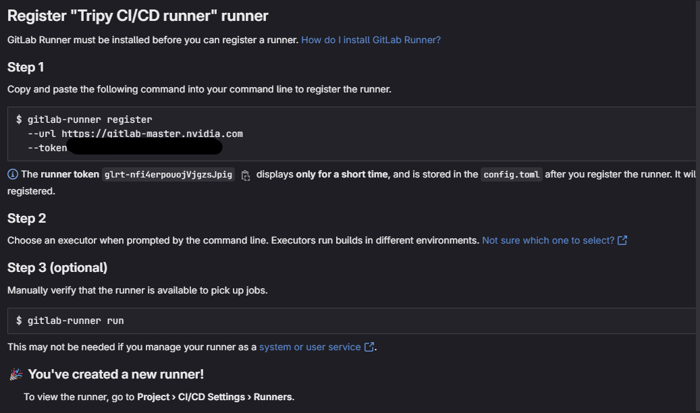
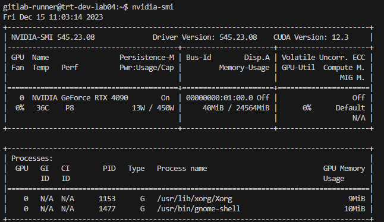

# Contributing To Tripy

## Install pre-commit

Before committing any changes, make sure you install the pre-commit hook.
From the [`tripy` root directory](.), run:
```bash
python3 -m pip install pre-commit
pre-commit install
```

## Using A Prebuilt Container For Development

The easiest way to get started with contributing is by using a prebuilt container.
The container includes all the dependencies you need for local development.
From the [`tripy` root directory](.), run:
```bash
docker login gitlab-master.nvidia.com:5005/tensorrt/poc/tripy
docker pull gitlab-master.nvidia.com:5005/tensorrt/poc/tripy
docker run --gpus all -it -v $(pwd):/tripy/ --rm gitlab-master.nvidia.com:5005/tensorrt/poc/tripy:latest
```
All dependencies have been configured, you can directly run tests in the prebuilt container.


## Tests

For details on how to run and add tests, see [the tests README](./tests/README.md).


## Building Documentation

For details on how to build and add documentation, see [the documentation README](./docs/README.md).

## Advanced: Building A Container Locally

1. (Optional) Manually build `mlir-tensorrt` integration library.

	If you did not modify `mlir-tensorrt.txt`, you can skip this step.
	A script will automatically download the latest `mlir-tensorrt` package in Step 2.

	Building `mlir-tensorrt` is done in a separate container than `tripy` as eventually `mlir-tensorrt`
	will not be shipped externally and saves adding additional complexity to `tripy` containers.

	1. Get `mlir-tensorrt` repository:

		```bash
		git clone ssh://git@gitlab-master.nvidia.com:12051/TensorRT/poc/mlir/mlir-tensorrt.git
		cd mlir-tensorrt && git checkout $(cat ../mlir-tensorrt.txt)
		git submodule update --init --depth 1
		```

	2. Install docker-compose:

		```bash
		sudo apt-get install docker-compose
		```

	3. Build the `mlir-tensorrt` container locally:

		```bash
		cd build_tools/docker
		docker compose up -d
		```

	4. Copy your SSH key to the container. You can use `docker container ls` or `docker ps` to find the `<container-id>`

		Launch the container and create .ssh folder in /root.
		```bash
		docker compose exec mlir-tensorrt-poc-dev bash
		mkdir /root/.ssh
		```

		Now, copy SSH keys to the container.
		```bash
		docker cp ~/.ssh/id_rsa <container-id>:/root/.ssh
		```

	5. Launch the container:

		```bash
		docker compose exec mlir-tensorrt-poc-dev bash
		```

	6. Build `mlir-tensorrt`:

		```bash
		cd /workspaces/mlir-tensorrt/
		cmake -B build -S . -G Ninja \
			-DCMAKE_BUILD_TYPE=RelWithDebInfo \
			-DCMAKE_CXX_COMPILER_LAUNCHER=ccache \
			-DCMAKE_C_COMPILER_LAUNCHER=ccache \
			-DCMAKE_C_COMPILER=clang -DCMAKE_CXX_COMPILER=clang++ \
			-DLLVM_USE_LINKER=lld \
			-DMLIR_TRT_ENABLE_TRIPY=ON

		ninja -C build all
		```

	7. (Optional) To verify the build, the below command should dump out an .mlir file with tensorrt operations:

		```bash
		./build/tools/mlir-tensorrt-opt examples/matmul_mhlo.mlir \
			-pass-pipeline="builtin.module(func.func(convert-hlo-to-tensorrt{allow-i64-to-i32-conversion},tensorrt-expand-ops,translate-tensorrt-to-engine))" \
			-mlir-elide-elementsattrs-if-larger=128
		```

	After building `mlir-tensorrt` project, the build will be available in the `tripy` container.
	The integrated tripy library file is `libtripy_backend_lib.so`.

2. Download dependencies from CI.

	Download `stablehlo` and `mlir-tensorrt` (if you do not have to manully build it), the script will skip downloading if the packages already exist. If you want to download the latest build, make sure to remove the existing packages from the tripy directory.

	```bash
	export TRIPY_GITLAB_API_TOKEN=<your-access-token>
	python3 scripts/download_dependencies.py
	```

3. Build the tripy container.

	From the [`tripy` root directory](.), run:
	```bash
	docker build -t tripy .
	docker run --gpus all -it -v $(pwd):/tripy/ --rm tripy:latest
	```

## Advanced: CI/CD GitLab Runner
```
ssh gitlab-runner@trt-dev-lab04.client.nvidia.com
passwd: Contact @jhalakp
bash install_gitlab_runner.sh
```

### How to add a GitLab runner


### Gitlab runner GPU stats

