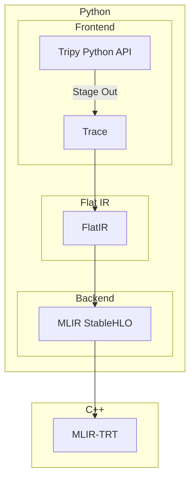
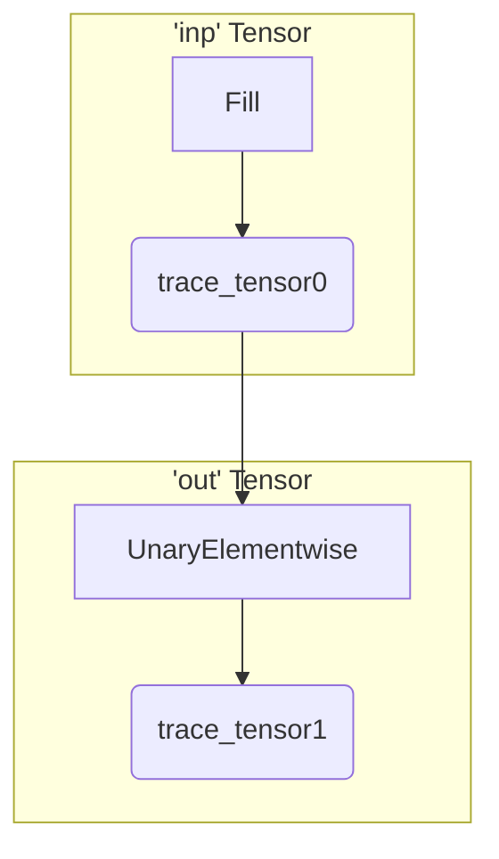

# Tripy Architecture

This document explains the overall architecture of Tripy.
As you read the rest of the document, you may find this diagram helpful to visualize where each
component fits in:





## A Day In The Life Of A Tripy Tensor

To understand these components better, let's take a look at what happens when we write a simple
program like:
```py
inp = tp.full((2, 3), value=0.5)
out = inp.tanh()
out.eval()
```

### Tracing

We'll start with the first line:

```py
inp = tp.full((2, 3), value=0.5)
```

#### Where Does `tp.full()` Come From?

The `tp.full()` API is part of the frontend and like other frontend functions, maps to one or more
(just one in this case) `Trace` operations. For frontend functions that map to exactly one `Trace` operation,
we define the function directly alongside the corresponding `Trace` operation.
In this case, the [`Fill` operation](../../tripy/frontend/trace/ops/fill.py) provides `tp.full()`.

*We organize it this way to reduce the number of files that need to be touched when adding new ops.*
    *If an operation is composed of multiple `Trace` operations, the frontend function can be*
    *defined under the [`frontend/ops`](../../tripy/frontend/ops) submodule instead.*

#### What Does It Do?

Tripy uses a lazy evaluation model; that means that computation doesn't happen immediately when you call a function
like `tp.full()`. Instead, all we do is create a frontend `Tensor` object which contains a `Trace` operation.
The `Trace` operation includes inputs and outputs in the form of `TraceTensor`s.

As we call other functions that use this frontend `Tensor`, we connect new `Trace` operations to its output
`TraceTensor`s. You can think of this as iteratively building up an implicit graph.

#### Calling `tanh()`

The next line looks fairly innocuous:
```py
out = inp.tanh()
```
However, if you look at the [source code](../../tripy/frontend/tensor.py) for the frontend `Tensor`, you'll
notice that there is no `tanh()` method defined there! How does that work?

We implement a [`TENSOR_METHOD_REGISTRY`](../../tripy/frontend/ops/registry.py) mechanism that allows us
to define `Tensor` methods out-of-line by decorating our functions with this registry:

<!-- Tripy Test: IGNORE Start -->
```py
@TENSOR_METHOD_REGISTRY("tanh")
def tanh(self) -> "tripy.Tensor":
    ...
```
<!-- Tripy Test: IGNORE End -->

In `Tensor`'s metaclass, we read the registry and dynamically add methods to the `Tensor` class accordingly.

#### The Implicit Frontend Graph

As mentioned before, as you create new frontend `Tensor`s, we build up an implicit graph comprised
of `Trace` operations and `TraceTensor`s.

After running both of these lines, our implicit graph will look something like this:



### Evaluation

The bulk of the real work happens once we reach the final line:
```py
out.eval()
```

As mentioned before, Tripy uses a lazy evaluation model where a tensor is only evaluated when it is used.
A tensor is considered "used" when, for example:

- We interoperate with another framework (e.g. `torch.from_dlpack(out)` or `out.numpy()`)
- When `__repr__` is called (e.g. if we `print(out)`)
- We explicitly call `eval()` as we're doing here.

In order to actually evaluate the tensor, a few different things need to happen:

#### Building The Trace

We start by building up the `Trace`. Since each frontend `Tensor` contains a `Trace` operation that's already
connected with the `Trace` operations in other tensors, we just need to walk backwards from the output tensor,
collecting trace operations as we go.

Here's the textual representation for the `Trace` from our example:
```
==== Trace IR ====
t0 = fill(value=0.5, shape=(2, 3), dtype=float32)
t1 = unaryelementwise(t0, kind=Kind.TANH)
outputs:
    t1: [shape=(2, 3,), dtype=(float32), loc=(gpu:0)]
```

<!-- TODO: Fix this if we change anything about shape/type inference -->
*NOTE: This information might become stale after we implement dynamic shapes. If you're seeing this note*
    *and tripy already supports dynamic shapes, please let us know so we can update the documentation!*

When we've built up the complete trace, we run shape, data type, and device inference. This is why the
output tensor in the trace has its `shape`, `dtype`, and `loc` fields populated.

#### Lowering To FlatIR

Once we have the `Trace`, we lower it into `FlatIR`. `FlatIR` is a very thin layer which provides a 1:1
mapping with StableHLO.

To perform the lowering, each `Trace` operation implements `to_flat_ir()`, which generates a subgraph with
one or more `FlatIR` operations.

Here's a snippet for how you might implement `tanh` (the actual implementation differs,
but this is good enough for a conceptual understanding):

```py
def to_flat_ir(self, inputs, outputs):
    from tripy.flat_ir.ops import TanhOp

    TanhOp(self, inputs, outputs)
```

Wait a second - what's happening here? The function doesn't return anything; in fact, it doesn't appear to be doing
anything at all!

The way this works is as follows: when we call `to_flat_ir()` we provide input and output
[`FlatIRTensor`](../../tripy/flat_ir/tensor.py)s. `to_flat_ir()` is responsible for generating a
subgraph of `FlatIR` operations that bind to these inputs and outputs. The
[`BaseFlatIROp` constructor](../../tripy/flat_ir/ops/base.py) updates the producer of its output tensors,
meaning that *just constructing a `FlatIR` operation is enough to add it to the subgraph*. Once this binding
is done, we take the resulting subgraph and inline it into the `FlatIR`, remapping the I/O tensors to those
that already exist in the `FlatIR`.

Here's the textual representation for the `FlatIR` from our example; you'll notice that we have more operations
now than we did in the trace:

```
==== Flat IR ====
t_inter1: [shape=(), dtype=(float32), loc=(gpu:0)] = ConstantOp(data=0.5, dtype=float32, device=gpu:0)
t0: [shape=(2, 3,), dtype=(float32), loc=(gpu:0)] = BroadcastOp(t_inter1, broadcast_dim=[])
t1: [shape=(2, 3,), dtype=(float32), loc=(gpu:0)] = TanhOp(t0)
outputs:
    t1: [shape=(2, 3,), dtype=(float32), loc=(gpu:0)]
```

#### Lowering To StableHLO

Our final translation step is to go from `FlatIR` into the `MLIR StableHLO` dialect.

Similar to `Trace` operations, `FlatIR` operations implement `to_mlir()` which generates StableHLO operations.
Unlike `Trace` operations, this is always a 1:1 mapping.

Here's a snippet for how [`tanh()` is implemented](../../tripy/flat_ir/ops/tanh.py):
```py
def to_mlir(self, operands):
    return [stablehlo.TanhOp(*operands)]
```

There's not much more to explain here, so let's go right to the textual representation:

```
==== StableHLO IR ====
1: module {
2:   func.func @main() -> tensor<2x3xf32> {
3:     %0 = stablehlo.constant dense<5.000000e-01> : tensor<f32>
4:     %1 = stablehlo.broadcast_in_dim %0, dims = [] : (tensor<f32>) -> tensor<2x3xf32>
5:     %2 = stablehlo.tanh %1 : tensor<2x3xf32>
6:     return %2 : tensor<2x3xf32>
7:   }
8: }
9:
```


#### Execution

TODO: Fill out this section
