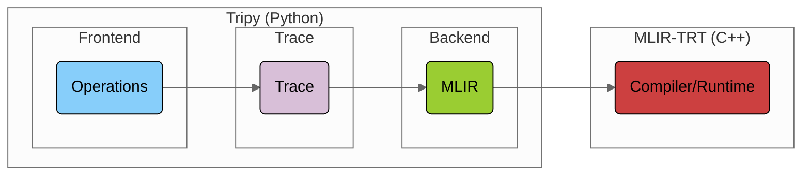
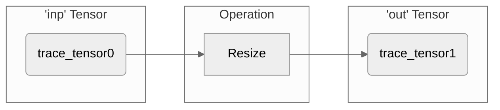

# Architecture

## Overview

Tripy builds an **MLIR** program by **tracing** functional-style **Python APIs**.

- The program is compiled and executed by
    [MLIR-TRT](https://github.com/NVIDIA/TensorRT-Incubator/tree/main/mlir-tensorrt).




1. [**Backend**](#backend): Interfaces with MLIR-TRT:

    - **Compiler** compiles tensorrt-dialect MLIR to an MLIR-TRT executable.

    - **Executable** wraps an MLIR-TRT executable in a Pythonic API.

2. [**Trace**](#trace): Computation graph of [`TraceTensor`](source:/nvtripy/trace/tensor.py)s
    and [`TraceOp`](source:/nvtripy/trace/ops/base.py)s that **lowers** to tensorrt-dialect MLIR.

3. [**Frontend**](#frontend): Exposes functional-style operations for {class}`nvtripy.Tensor`s.

:::{note}
Frontend/Backend refer to the flow of execution, not what the user does/doesn't see.

Public APIs are exposed by both the frontend (e.g. {func}`nvtripy.resize`) and backend (e.g. {func}`nvtripy.compile`).
:::

## Source Code Links

- [**Frontend**](source:/nvtripy/frontend)
    - [Tensor](source:/nvtripy/frontend/tensor.py)
    - [Operations](source:/nvtripy/frontend/ops/)
- [**Trace**](source:/nvtripy/trace)
    - [TraceTensor](source:/nvtripy/trace/tensor.py)
    - [Operations](source:/nvtripy/trace/ops/)
- [**Backend**](source:/nvtripy/backend)
    - [`compile`](source:/nvtripy/backend/api/compile.py)
    - [Executable](source:/nvtripy/backend/api/executable.py)


## The Stack By Example

Consider a simple example:

```py
def scale_up(inp):
    out = tp.resize(inp, scales=(2, 2), mode="linear")
    out.name = "out" # Setting name for IR readability
    return out

compiled_func = tp.compile(scale_up, args=[tp.InputInfo((2, 2), dtype=tp.float32)])

inp = tp.iota((2, 2), dtype=tp.float32)
out = compiled_func(inp)
```

### Frontend

The frontend exposes {class}`nvtripy.Tensor` (wraps [`TraceTensor`](source:/nvtripy/trace/tensor.py))
and various operations, e.g. {class}`nvtripy.resize`.

:::{admonition} Info
Most operations are decorated with:
1. [`@export.public_api`](source:/nvtripy/export.py): Enables documentation, type checking, and overloading.
2. [`@wrappers.interface`](source:/nvtripy/utils/wrappers.py): Enforces (and generates tests for) data type constraints.
:::

Operations are **lazily evaluated**.
Calling them just builds up an implicit graph of [`TraceOp`](source:/nvtripy/trace/ops/base.py)s:



:::{note}
To evaluate ouptuts, the graph must first be **compiled**:

- In **eager mode**, this happens when a frontend tensor is used (printed, `.eval()`'d, or exported w/ DLPack).
- In **compiled mode**, the user explicitly compiles a function or {class}`nvtripy.Module`.
:::

### Trace

To build the [`Trace`](source:/nvtripy/trace/trace.py), we walk backwards from the output(s) and accumulate operations:

<!-- Tripy: DOC: OMIT Start -->
```py
# doc: no-print-locals
with tp.logger.use_verbosity("trace"):
    compiled_func = tp.compile(scale_up, args=[tp.InputInfo((2, 2), dtype=tp.float32)])
```
<!-- Tripy: DOC: OMIT End -->

Each trace operation corresponds one-to-one to an MLIR operation of the `tensorrt` dialect and has 2 responsibilities:

1. Implement MLIR **conversion logic**.

2. Compute **operation metadata**, e.g. number of outputs, rank inference, etc.

:::{admonition} Info
The extra indirection of a "Trace" is required so we can infer ranks, data types, and devices for the frontend.
:::

### Backend

The backend uses `Trace.to_mlir()` to generate an MLIR program using the `tensorrt` dialect:

<!-- Tripy: DOC: OMIT Start -->
```py
# doc: no-print-locals
with tp.logger.use_verbosity("mlir"):
    compiled_func = tp.compile(scale_up, args=[tp.InputInfo((2, 2), dtype=tp.float32)])
```
<!-- Tripy: DOC: OMIT End -->

The program is compiled by MLIR-TRT to an MLIR-TRT executable, which is wrapped
in an {class}`nvtripy.Executable`.

The MLIR-TRT executable interfaces with `memref`s; data in frontend tensors is stored as
`memref`s in the [`Constant`](source:/nvtripy/trace/ops/constant.py) operation.

## Building Better Errors

- Frontend tensors store [stack information](source:/nvtripy/utils/stack_info.py) in their
    corresponding trace tensors upon creation.

- When generating MLIR operations, we encode the trace tensor names in their **location** attributes.

- If there is an error from the compiler, we map the location from the error to
    the user's code via the stack information in the trace tensor.
