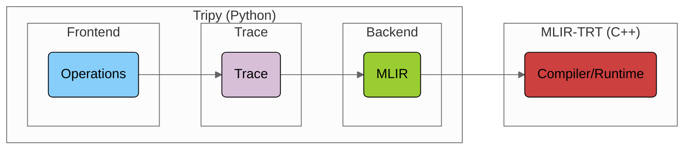
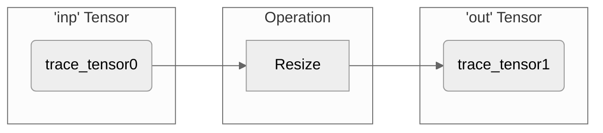

# Architecture

## Overview

Tripy builds an **MLIR** program by **tracing** functional-style **Python APIs**.

- The program is compiled and executed by
    [MLIR-TRT](https://github.com/NVIDIA/TensorRT-Incubator/tree/main/mlir-tensorrt).



```mermaid
%%{init: {'theme':'neutral'}}%%
graph LR
    subgraph "Tripy (Python)"
        subgraph "Frontend"
            A("Operations"):::frontend
        end

        subgraph "Trace"
            A --> B("Trace"):::trace
        end

        subgraph "Backend"
            B --> C("MLIR"):::backend
        end
    end

    subgraph "MLIR-TRT (C++)"
        C --> D("Compiler/Runtime"):::mlirtrt
    end

    classDef frontend fill:#87CEFA,stroke:#000,stroke-width:1px;
    classDef trace fill:#D8BFD8,stroke:#000,stroke-width:1px;
    classDef backend fill:#9ACD32,stroke:#000,stroke-width:1px;
    classDef mlirtrt fill:#CC4040,stroke:#000,stroke-width:1px;
```

1. [**Backend**](#backend): Interfaces with MLIR-TRT:

    - **Compiler** compiles tensorrt-dialect MLIR to an MLIR-TRT executable.

    - **Executable** wraps an MLIR-TRT executable in a Pythonic API.

2. [**Trace**](#trace): Computation graph of [`TraceTensor`](source:/nvtripy/trace/tensor.py)s
    and [`TraceOp`](source:/nvtripy/trace/ops/base.py)s that **lowers** to tensorrt-dialect MLIR.

3. [**Frontend**](#frontend): Exposes functional-style operations for {class}`nvtripy.Tensor`s.

:::{note}
Frontend/Backend refer to the flow of execution, not what the user does/doesn't see.

Public APIs are exposed by both the frontend (e.g. {func}`nvtripy.resize`) and backend (e.g. {func}`nvtripy.compile`).
:::

## The Stack By Example

Consider a simple example:

```py
def func(inp):
    return tp.resize(inp, mode="linear", scales=(2, 2))

compiled_func = tp.compile(func, args=[tp.InputInfo((2, 2), dtype=tp.float32)])

inp = tp.iota((2, 2), dtype=tp.float32)
out = compiled_func(inp)
```

### Frontend

The frontend exposes {class}`nvtripy.Tensor` which wraps a [`TraceTensor`](source:/nvtripy/trace/tensor.py)
and various operations, e.g. {class}`nvtripy.resize`.

:::{admonition} info
Most operations are decorated with:
1. [`@export.public_api`](source:/nvtripy/export.py): Enables documentation, type checking, and overloading.
2. [`@wrappers.interface`](source:/nvtripy/utils/wrappers.py): Enforces (and generates tests for) data type constraints.
:::

Operations are **lazily evaluated**.
Calling them just builds up an implicit graph of [`TraceOp`](source:/nvtripy/trace/ops/base.py)s:


```mermaid
%%{init: {'theme':'neutral'}}%%
graph LR
    subgraph "'inp' Tensor"
        A(trace_tensor0)
    end

    subgraph "Operation"
    A --> B[Resize]
    end

    subgraph "'out' Tensor"
        B --> C(trace_tensor1)
    end
```

:::{note}
*No computation is performed* until a frontend tensor is used (printed, `.eval()`'d, or exported w/ DLPack).
:::

### Trace

<!-- TODO: Discuss what a trace op is - not too much detail, cover in how-to-add ops -->

### Backend

<!-- TODO: Discuss compiler and runtime -->
<!-- TODO: Cover how location attribute is used to map errors back?  -->
