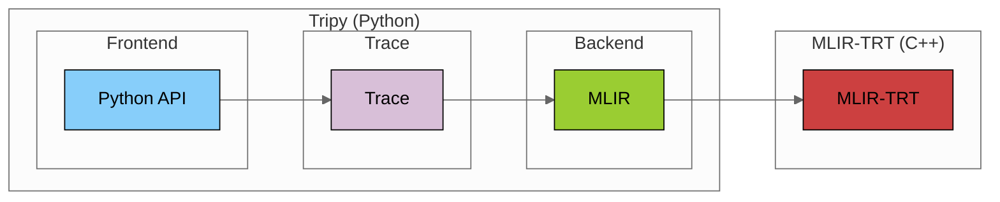

# Architecture

## Overview

Tripy builds an **MLIR** program by **tracing** functional-style **Python APIs**.

The program is compiled and executed by
[MLIR-TRT](https://github.com/NVIDIA/TensorRT-Incubator/tree/main/mlir-tensorrt):

```mermaid
%%{init: {'theme':'neutral'}}%%
graph LR
    subgraph "Tripy (Python)"
        subgraph "Frontend"
            A["Python API"]:::frontend
        end

        subgraph "Trace"
            A --> B["Trace"]:::trace
        end

        subgraph "Backend"
            B --> C["MLIR"]:::backend
        end
    end

    subgraph "MLIR-TRT (C++)"
        C --> D["MLIR-TRT"]:::mlirtrt
    end

    classDef frontend fill:#87CEFA,stroke:#000,stroke-width:1px;
    classDef trace fill:#D8BFD8,stroke:#000,stroke-width:1px;
    classDef backend fill:#9ACD32,stroke:#000,stroke-width:1px;
    classDef mlirtrt fill:#CC4040,stroke:#000,stroke-width:1px;
```

Tripy's 3 main components are:

1. **Backend**: Interfaces with MLIR-TRT:

    - The **Compiler** compiles tensorrt-dialect MLIR to an MLIR-TRT executable

    - The **Executable** wraps an MLIR-TRT executable to allow for inference with {class}`nvtripy.Tensor`s.

2. **Trace**: Represents the computation graph as [`TraceTensor`s](source:/nvtripy/trace/tensor.py)
    and [`TraceOp`s](source:/nvtripy/trace/ops/base.py) and can **lower** to tensorrt-dialect MLIR.

3. **Frontend**: Exposes functional-style Python APIs that work with {class}`nvtripy.Tensor`s.

## Frontend

<!-- TODO: Discuss `public_api` decorator - controls docs, type checking, overloading -->
<!-- TODO: Discuss how each frontend tensor contains a trace tensor -->
