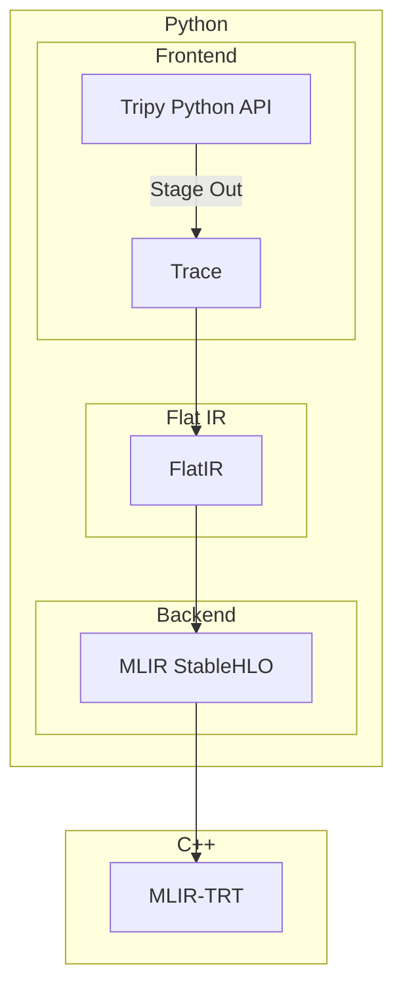
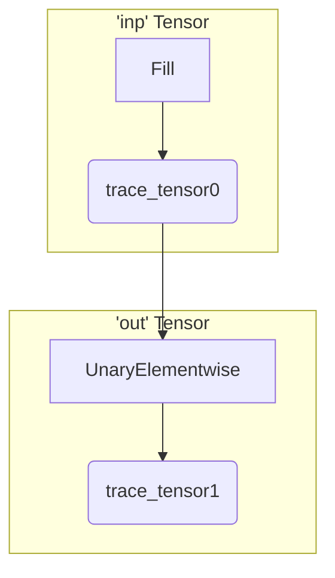

# Architecture

This document explains the overall architecture of Tripy.


## Overview

The main technical requirement of Tripy is twofold:

1. We must be able to provide a Pythonic, functional style interface to the user.
2. We must be able to provide a computation graph to the compiler.

Tripy uses a series of intermediate representations to solve this problem.
Below is a diagram of how these IRs are connected to each other:



### Trace

The `Trace` is meant to provide a 1:1 graph representation of the user's Python code.
It is a bipartite graph consisting of Trace `Operation`s and `TraceTensor`s - each Trace `Operation`
is connected to input/output `TraceTensor`s and each `TraceTensor` has knowledge of its
producer Trace `Operation`.


### FlatIR

The `FlatIR` is a lower level representation that provides a 1:1 mapping to MLIR operations.
Like the `Trace`, it is a bipartite graph consisting of FlatIR `Operation`s and `FlatIRTensor`s.


### MLIR

The final representation before we hand off to the compiler is the MLIR itself, which, in our case,
consists primarily of StableHLO operations but can also include other dialects for certain operations.


## A Day In The Life Of A Tripy Tensor

To understand these components better, let's take a look at what happens when we write a simple
program like:
```py
# doc: no-print-locals
inp = tp.full((2, 3), value=0.5)
out = tp.tanh(inp)
out.eval()
```


### Tracing

We'll start with the first line:

```py
# doc: no-eval
inp = tp.full((2, 3), value=0.5)
```

#### Where Do `tp.full()` and `tp.tanh()` Come From?

The `tp.full()` and `tp.tanh()` APIs are part of the frontend and like other frontend functions, map to one or more
(just one in this case) `Trace` operations. For frontend functions that map to exactly one `Trace` operation,
we define the function directly alongside the corresponding `Trace` operation.
In this case, the [`Fill` operation](source:/tripy/frontend/trace/ops/fill.py) provides `tp.full()` and
the [`UnaryElementwise` operation](source:/tripy/frontend/trace/ops/unary_elementwise.py) provides `tp.tanh()`.

*We organize it this way to reduce the number of files that need to be touched when adding new ops.*
    *If an operation is composed of multiple `Trace` operations, the frontend function can be*
    *defined under the [`frontend/ops`](source:/tripy/frontend/ops) submodule instead.*

#### What Does It Do?

Tripy uses a lazy evaluation model; that means that computation doesn't happen immediately when you call a function
like `tp.full()` or `tp.tanh()`. Instead, all we do is create a frontend `Tensor` object which contains a `Trace` operation.
The `Trace` operation includes inputs and outputs in the form of `TraceTensor`s and is essentially just a symbolic
representation of the computation that needs to be done.

As we call other functions that use this frontend `Tensor`, we connect new `Trace` operations to its output
`TraceTensor`s. You can think of this as iteratively building up an implicit graph.


#### The Implicit Frontend Graph

As mentioned before, as you create new frontend `Tensor`s, we build up an implicit graph comprised
of `Trace` operations and `TraceTensor`s.

After running both of these lines, our implicit graph will look something like this:



### Evaluation

The bulk of the real work happens once we reach the final line:
```py
# doc: no-eval
out.eval()
```

As mentioned before, Tripy uses a lazy evaluation model where a tensor is only evaluated when it is used.
A tensor is considered "used" when, for example:

- We interoperate with another framework (e.g. `torch.from_dlpack(out)` or `np.from_dlpack(out)`)
- When `__repr__` is called (e.g. if we `print(out)`)
- We explicitly call `eval()` as we're doing here.

In order to actually evaluate the tensor, a few different things need to happen:

#### Building The Trace

We start by building up the `Trace`. Since each frontend `Tensor` contains a `Trace` operation that's already
connected with the `Trace` operations in other tensors, we just need to walk backwards from the output tensor,
collecting trace operations as we go.

Here's the textual representation for the `Trace` from our example:

<!-- Tripy: DOC: OMIT Start -->
```py
# doc: no-print-locals
from tripy.frontend.trace import Trace
# Output has been eval'd already, so we'll construct a new one
new_out = tp.tanh(inp)
trace = Trace([new_out])
print(trace)
```
<!-- Tripy: DOC: OMIT End -->

When we've built up the complete trace, we run rank, data type, and device inference. This is why the
output tensor in the trace has its `rank`, `dtype`, and `loc` fields populated.

#### Lowering To FlatIR

Once we have the `Trace`, we lower it into `FlatIR`. `FlatIR` is a very thin layer which provides a 1:1
mapping with the MLIR dialects we use.

To perform the lowering, each `Trace` operation implements `to_flat_ir()`, which generates a subgraph with
one or more `FlatIR` operations.

Here's a snippet for how you might implement `tanh` (the actual implementation differs,
but this is good enough for a conceptual understanding):

```py
def to_flat_ir(self, inputs, outputs):
    from tripy.flat_ir.ops import TanhOp

    TanhOp.build(inputs, outputs)
```

Wait a second - what's happening here? The function doesn't return anything; in fact, it doesn't appear to be doing
anything at all!

The way this works is as follows: when we call `to_flat_ir()` we provide input and output
[`FlatIRTensor`](source:/tripy/flat_ir/tensor.py)s. `to_flat_ir()` is responsible for generating a
subgraph of `FlatIR` operations that bind to these inputs and outputs. The
[`BaseFlatIROp` build function](source:/tripy/flat_ir/ops/base.py) updates the producer of the output tensors,
meaning that *just building a `FlatIR` operation is enough to add it to the subgraph*. Once this binding
is done, we take the resulting subgraph and inline it into the `FlatIR`, remapping the I/O tensors to those
that already exist in the `FlatIR`.

Here's the textual representation for the `FlatIR` from our example; you'll notice that we have more operations
now than we did in the trace:

<!-- Tripy: DOC: OMIT Start -->
```py
# doc: no-print-locals
flat_ir = trace.to_flat_ir()
print(flat_ir)
```
<!-- Tripy: DOC: OMIT End -->

#### Lowering To MLIR

Our final translation step is to go from `FlatIR` into MLIR.

Similar to `Trace` operations, `FlatIR` operations implement `to_mlir()` which generates MLIR operations.
Unlike `Trace` operations, this is always a 1:1 mapping.

Here's a snippet for how [`tanh()` is implemented](source:/tripy/flat_ir/ops/tanh.py):
```py
def to_mlir(self, operands):
    return [stablehlo.TanhOp(*operands)]
```

There's not much more to explain here, so let's go right to the textual representation:

<!-- Tripy: DOC: OMIT Start -->
```py
# doc: no-print-locals
print(flat_ir.to_mlir())
```
<!-- Tripy: DOC: OMIT End -->

#### Compilation

Once we have the complete MLIR representation, we then compile it to an executable using the MLIR-TRT compiler.


#### Execution

Finally, we use the MLIR-TRT executor to launch the executable and retrieve the output tensors.
The executable returns [`memref`s](https://mlir.llvm.org/docs/Dialects/MemRef/) which we then
wrap in Tripy frontend {class}`tripy.Tensor`s.
